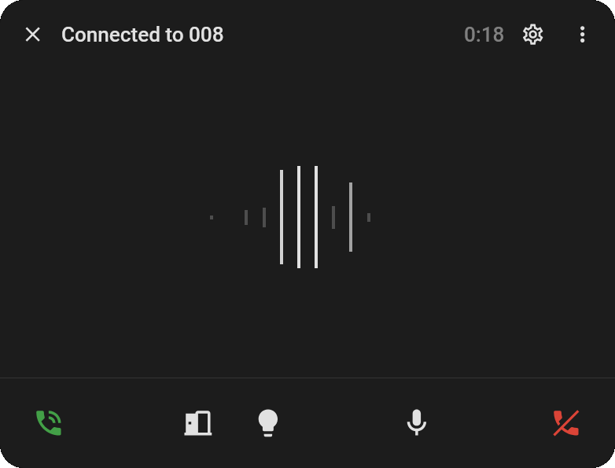
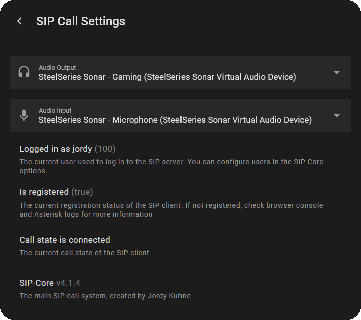
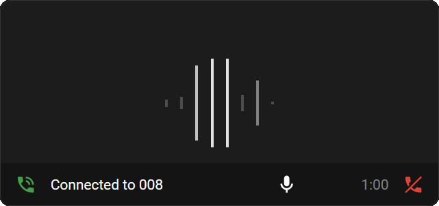
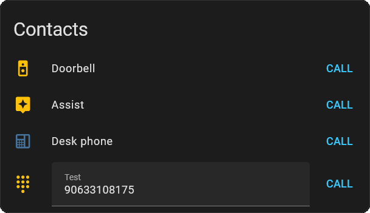

 

  

 

**🚀 Make and receive SIP calls directly in your Home Assistant dashboard**

 

SIP Core, part of the SIP-HASS project, is the system that powers Home Assistant cards to make and receive SIP calls using WebRTC.
It includes official cards and popups, but also supports third-party cards.

 

## ✨ Features

  * 📞 Make and receive calls
  * 🔔 (Custom) Ringtones
  * 📹 Video calls
  * 🔢 DTMF support
  * 🪟 Popups for incoming calls
  * 🚀 Auto call on load (using `?call=<number>` in the URL)
  * 🎤 Audio device selection
  * 🛠️ API for third-party developers to build custom cards and popups

## Default Popup

  
  

- 🚪 Automatically opens on incoming calls
- 📊 Audio Visualizer
- ⚙️ Menu to configure audio devices
  - 🐛 And shows debug information
- 🎮 Custom buttons
- 🔇 Mute mic & camera buttons

## Call Card

`custom:sip-call-card`
 
- 📊 Audio Visualizer
- 📹 Supports camera entities for video
- 🎮 Custom buttons for quick actions
- 🔇 Mute mic & camera buttons

 
 

## Contacts Card

`custom:sip-contacts-card`

- 📞 Start calls to users/numbers
- 👤 Option to hide your own user
- 🎨 Custom names & icons
- ✏️ Open field option
- 🟢 State color with status entity

 
 

## 📋 Requirements
For this to work you will need the following:
 * ☎️ A sip/pbx server (Works best with the [Asterisk add-on](https://github.com/TECH7Fox/Asterisk-add-on))
 * 🔒 HTTPS for Home Assistant
 * 📦 HACS for easy installation

## 📚 Wiki

You can find the installation instructions and guides on the documentation site: <kbd>[SIP-HASS Docs](https://tech7fox.github.io/sip-hass-docs/)</kbd>

## ⭐ Star History

